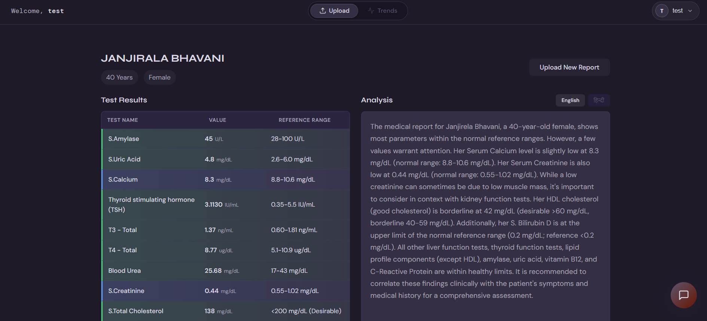
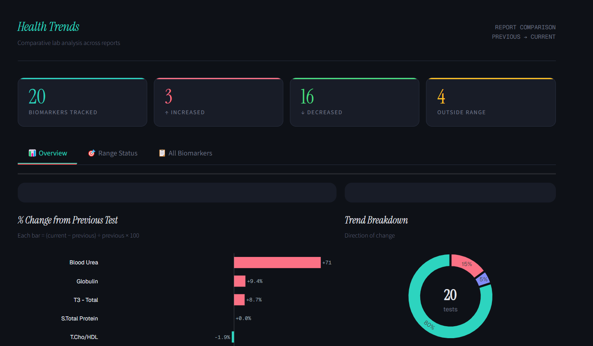
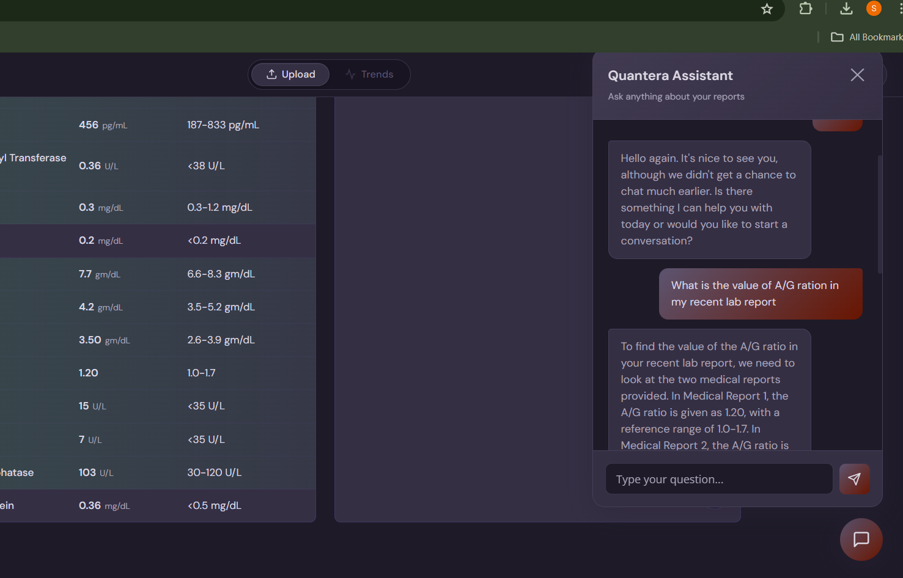
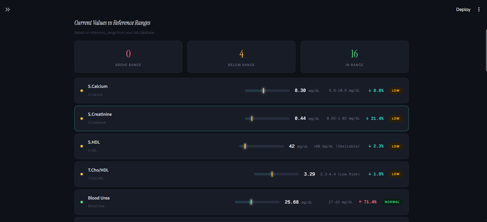
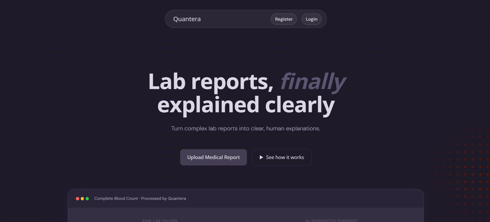

KLH — Medical Reports AI Assistant
=================================

KLH is an AI-powered medical report ingestion and assistant platform. The server ingests PDFs and images, extracts text via OCR, uses an LLM to parse structured medical data, stores embeddings and test values, and provides a conversational AI assistant (RAG) for both general and medical-specific questions.

Highlights
----------
- OCR extraction from images and PDFs (Tesseract + pdf-poppler)
- LLM parsing (Google Gemini / Groq / OpenAI integrations) to extract structured medical fields and multilingual explanations
- Embeddings for RAG-style retrieval over past reports
- Conversational AI assistant with intent detection (medical vs non-medical)
- Persistence of reports, extracted tests, and embeddings (MySQL)
- Streamlit utilities for quick analysis and prototyping

Repository Layout
-----------------
- `client/` — React + Vite frontend (dashboard, chat UI, uploads)
- `server/` — Express API, ingestion, agent, controllers, and models
- `streamlit/` — analysis notebooks and dashboards

Core Flow
---------
1. User uploads medical reports via `/api/upload` (authenticated).
2. Server extracts text with OCR and converts PDFs to images when needed.
3. Extracted text is sent to the LLM to produce strict JSON (structured tests, patient metadata, multilingual explanations).
4. LLM output is embedded and stored; test values are saved to the DB.
5. The `/api/ask` endpoint uses embeddings + recent conversation memory to answer user questions — medical questions trigger RAG over saved reports.

User Flow (UI walkthrough)
--------------------------
The application UI follows a simple, user-friendly flow. Below are the typical screens and actions (images are stored in `client/public`):

- Upload reports: drag-and-drop or select files (images/PDF). See Upload image:



- Dashboard / Trends: real-time trends and per-user analytics. Example trend view:



- AI Assistant: ask questions and receive context-aware answers (RAG). Assistant UI:



- Additional views: alternate trend view and home image for branding.




Tip: Replace or extend the images in `client/public` with your project screenshots. The README will render these in GitHub and other Markdown viewers.

Architecture Diagram
--------------------
The architecture diagram (Mermaid source) is available at `client/public/architecture.mmd`. You can render it locally (Mermaid CLI or compatible viewer) or open it in tools that support Mermaid.

Mermaid source (quick preview):

```mermaid
flowchart TD
	subgraph Client
		A[Upload UI \n(drag & drop)] -->|files| B[API: /api/upload]
		C[AI Assistant UI] -->|question| D[API: /api/ask]
		E[Dashboard/Trends] -->|view| F[API: /api/trends]
	end

	subgraph Server (Express)
		B --> G[Ingest Controller \nOCR (Tesseract) + PDF conversion]
		G --> H[LLM Parser \n(Gemini / Groq / OpenAI)]
		H --> I[Embedding Generator]
		I --> J[MySQL: reports, tests, embeddings]
		D --> K[Agent Controller \nIntent detection + RAG]
		K --> J
		F --> J
	end

	subgraph Streamlit
		S[Streamlit analytics] -->|reads| J
	end

	subgraph External
		N[LLM Providers \n(Gemini, Groq, OpenAI)]
		O[Tesseract & Poppler]
		P[Email / SMTP]
	end

	H --> N
	G --> O
	Server --> P

	classDef infra fill:#f9f,stroke:#333,stroke-width:1px;
	class Server,External,Streamlit infra;
```

If you'd like, I can also generate a rendered SVG/PNG using the Mermaid CLI and add it to `client/public`.

Architecture (detailed)
-----------------------
Overview:
- Client: React + Vite frontend provides upload UI, dashboard/trends, and the AI Assistant chat interface. Static assets and screenshots live in `client/public`.
- Server: Express-based API handles authentication, file ingestion, OCR, LLM parsing, embedding generation, and agent logic (`/api/upload`, `/api/ask`, `/api/trends`).
- Storage & DB: MySQL stores reports, parsed test values, embeddings, and chat history. Uploaded files are stored under `server/uploads` (or a cloud object store in production).
- OCR / PDF conversion: Tesseract (host) and Poppler (`pdf-poppler`) perform OCR and PDF→image conversion for multi-page PDFs.
- LLM providers: Google Gemini, Groq, and OpenAI are optional fallbacks used for parsing and assistant responses. Embeddings are generated using the configured embedding utility.
- Streamlit: read-only analytics and developer dashboards live under `streamlit/` and query the same database for quick insights.

Data flow (step-by-step):
1. User uploads image(s) or PDF(s) from the client UI to `POST /api/upload` with JWT authentication.
2. Server saves the files, converts PDFs to images (if required), and runs OCR to extract raw text.
3. Extracted text is sent to the configured LLM with a strict JSON prompt; the LLM returns structured fields (patient, tests, values) and multilingual explanations.
4. The server generates an embedding for the LLM output and saves the embedding, structured fields, and test values to MySQL.
5. For conversational queries (`POST /api/ask`): the agent controller detects intent (medical vs non-medical). Medical intents trigger RAG: nearest embeddings + recent conversation history are provided to the LLM to answer with citations.
6. Streamlit or the dashboard reads aggregated results from MySQL to show trends, ITC-like analytics, and per-user visualizations.

Tech choices & rationale:
- Express (Node.js) — lightweight API and existing codebase.
- MySQL — relational storage for structured test fields and embeddings (can be migrated to vector DB later).
- Tesseract + Poppler — robust, open-source OCR + PDF conversion for high accuracy on medical reports.
- LLM provider chain — supports fallbacks and local vs cloud deployment depending on privacy needs.

Deployment & scaling notes:
- In production, run the server behind a reverse proxy (Nginx/Caddy) and use HTTPS.
- Use a managed MySQL instance or a separate container; backups and encryption at rest are required for PHI.
- For higher RAG throughput, consider using a dedicated vector DB (Pinecone, Milvus, or Neo4j with vector support) and async worker queues for embedding generation.
- Keep LLM requests rate-limited and cache common parsing outputs to reduce cost.

Security & privacy:
- Treat uploaded medical files and parsed data as protected health information (PHI). Use TLS, encrypted DB connections, and least-privilege access.
- Rotate and store secrets in a vault; never commit API keys or secrets to git.


Key Server Routes
-----------------
- `POST /api/register` — user signup
- `POST /api/login` — user signin
- `POST /api/send-mail` — trigger emails
- `POST /api/upload` — authenticated file upload (images/PDFs)
- `POST /api/ask` — ask the AI assistant (authenticated)
- `GET /api/trends` — user-specific trends and analytics (authenticated)

Prerequisites
-------------
- Node.js 18+
- Python 3.11+ (for Streamlit utilities)
- Tesseract OCR installed on the host
- Poppler utilities installed (for `pdf-poppler`)
- A running MySQL server (or adapt `reportModel` to your DB)
- Optional: Google Gemini / Groq / OpenAI API keys for LLM features

Environment Variables (server/.env)
----------------------------------
- `PORT` — server port (default 5000)
- `JWT_SECRET` — JWT signing secret
- `MYSQL_HOST` — MySQL host
- `MYSQL_USER` — MySQL user
- `MYSQL_PASSWORD` — MySQL password
- `MYSQL_DATABASE` — MySQL database name
- `GEMINI_API_KEY` — Google Gemini key (optional)
- `GROQ_API_KEY` — Groq.ai key (optional)
- `OPENAI_API_KEY` — OpenAI key (optional)
- `GROQ_API_KEY` — Groq API key (used by `agentController` / tag generation)

Quick Start (development)
-------------------------
1) Server

```bash
cd server
npm install
# run the server (or use nodemon)
node server.js
```

2) Client

```bash
cd client
npm install
npm run dev
```

3) Streamlit (optional)

```bash
cd streamlit
python -m pip install -r requirements.txt
streamlit run app.py
```

Running a sample upload
-----------------------
- Use the web UI to upload images/PDFs, or POST to `/api/upload` with a valid JWT and `multipart/form-data` containing `file`.

Notes & Troubleshooting
-----------------------
- Ensure Tesseract and Poppler are installed and on your PATH; OCR and PDF conversion will fail otherwise.
- LLM integrations are optional: if no API keys are provided, the app uses cached fallbacks or returns informative messages rather than crashing.
- `server/models/reportModel.js` contains DB access patterns; update connection settings and schema to match your MySQL setup.

Security and Privacy
--------------------
- Medical data is sensitive. Use secure storage, encrypted DB connections, and proper access controls in production.
- Do not commit API keys or secrets into source control. Use environment variables or secret stores.

Contributing
------------
Please open issues for bugs or feature requests. Pull requests are welcome — keep changes focused and include tests where appropriate.

License
-------
Declare your project license here.

Maintainers
-----------
Add maintainer contact or team info here.
